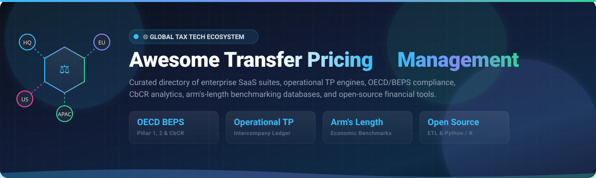
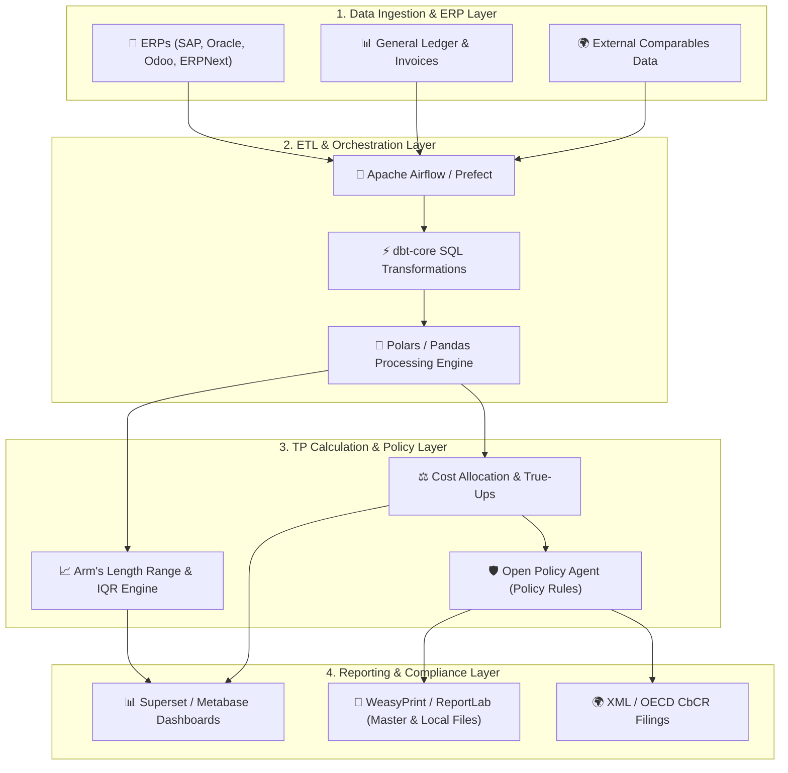

  

  # 📊 Awesome Transfer Pricing Management 🌐

  

  **A Curated Directory of Enterprise SaaS Platforms, Operational TP Engines, OECD BEPS Compliance Solutions, and Open-Source Financial Building Blocks.**

  *Intercompany Pricing ⚖️ • Arm's-Length Benchmarking 🔍 • OECD BEPS Pillar 1 &amp; 2 📑 • CbCR Reporting 🌍 • Master &amp; Local Files 📁 • Tax Technology 💻*

  **Last updated: August 2026**

---

## 📖 Overview & SEO Summary

**Transfer Pricing Management (TPM)** is a critical discipline within international corporate taxation, finance, and accounting. Multinational Enterprises (MNEs) leverage transfer pricing software to establish, monitor, and defend cross-border intercompany transactions in compliance with the **OECD Transfer Pricing Guidelines**, **BEPS Actions (Base Erosion and Profit Shifting)**, **Pillar Two Global Minimum Tax (GloBE Rules)**, and local statutory tax regulations across global tax authorities (IRS, HMRC, ATO, FTA, etc.).

Key operational and strategic workflows addressed by these platforms include:
- 📑 **OECD Documentation Automation**: Seamless compilation of Master Files, Local Files, and Country-by-Country Reports (CbCR).
- 🔍 **Economic Benchmarking & Comparability Studies**: Searching global databases (Orbis, Amadeus, Moody's TP Catalyst) to identify comparable companies and calculate arm's-length interquartile ranges.
- ⚙️ **Operational Transfer Pricing (OTP)**: Real-time transaction pricing, cost-center allocation, true-up adjustments, intercompany invoice reconciliation, and segmented profit & loss (P&L) tracking.
- ⚖️ **Audit Defense & Controversy Management**: Maintaining centralized data rooms, historical audit trails, tax authority inquiry responses, and Advance Pricing Agreement (APA) tracking.

---

## 📑 Table of Contents

- [🏢 SaaS & Enterprise Hosted Platforms](#-saas--enterprise-hosted-platforms)
- [💻 Open-Source GitHub Projects](#-open-source-github-projects)
- [🏗️ Architectural Blueprint for Custom TP Systems](#️-architectural-blueprint-for-custom-tp-systems)
- [🤝 How to Contribute](#-how-to-contribute)
- [📈 Star History](#-star-history)
- [⚖️ Disclaimer](#️-disclaimer)

---

## 🏢 SaaS & Enterprise Hosted Platforms

The table below catalogs premier commercial Transfer Pricing and International Tax suites, sorted in **descending order by company scale** (annual global revenue or enterprise market valuation):

| 🏢 Product / Platform | 💼 Description | 📈 Company Size (Revenue / Valuation) | 💵 Pricing (Starting Tier) | 🎁 Free Tier / Free Trial Limits |
| :--- | :--- | :--- | :--- | :--- |
| **[Deloitte TP Catalyst](https://www2.deloitte.com/)** | Deloitte’s technology-enabled transfer pricing platform delivering global comparability benchmarking, financial analytics, and BEPS compliance workflows. | **~$67.2 Billion** Annual Global Revenue *(Big 4 Leader)* | Starting at **£350/user/year** (~$450/year) for baseline TP Catalyst search access; enterprise corporate benchmarking suites from **$15,000/year**. | **7-day free trial** via Moody's/Bureau van Dijk portal (includes access to comparable search module and 5 sample benchmarking company exports). |
| **[KPMG Digital Gateway](https://kpmg.com/)** | KPMG’s integrated digital tax and transfer pricing ecosystem for automated documentation, BEPS 2.0 Pillar Two modeling, and operational transfer pricing. | **~$38.5 Billion** Annual Global Revenue *(Big 4 Network)* | Starting at **$25,000/year** for individual Digital Gateway tax automation & transfer pricing solution modules. | **90-day free trial** for select Digital Gateway generative AI and tax data components (guided pilot sandbox for up to 5 users). |
| **[ONESOURCE Transfer Pricing (Thomson Reuters)](https://tax.thomsonreuters.com/)** | Enterprise-grade transfer pricing solution covering end-to-end documentation workflows, operational TP calculations, benchmarking databases, and audit-ready reporting. | **~$7.2 Billion** Annual Revenue / **~$78 Billion** Market Cap *(NASDAQ: TRI)* | Starting at **$35,000/year** for base named-user TP compliance modules (enterprise deployments typically start at **$50,000/year**). | **14-day to 30-day free trial** for ONESOURCE Analyzer Suite/Global Trade modules (single-user sandbox dataset; no free-forever plan). |
| **[Corptax (CSC)](https://www.corptax.com/)** | Comprehensive corporate tax compliance and provision platform with multi-entity transfer pricing capabilities used by over 50% of the Fortune 500. | **~$2.0 Billion+** Parent Revenue / **~$10 Billion+** Valuation *(CSC / Intertrust)* | Starting at **$40,000/year** for standard corporate tax compliance and TP modules (average package ~$80,000/year). | **14-day proof-of-concept trial** (test corporate structure datasets, restricted export capabilities; no free-forever plan). |
| **[Alteryx Transfer Pricing Solutions](https://www.alteryx.com/)** | Advanced analytics and workflow automation platform used by tax departments to construct automated TP data pipelines, cost allocations, and margin true-ups. | **~$4.4 Billion** Valuation *(Clearlake / Insight)* / **~$1.0 Billion** ARR | Starting at **$3,000/user/year** (Alteryx One Starter / Cloud Designer) or **$5,195/user/year** (Designer Desktop). | **30-day free trial** (unlimited workflow runs on Designer Desktop/Cloud for 1 user seat); **1-year free license** for students/educators via SparkED. |
| **[Longview Tax (insightsoftware)](https://insightsoftware.com/)** | Specialized tax provision and operational transfer pricing platform focused on ERP data consolidation, segmented profitability analysis, and true-up automation. | **~$4.0 Billion** Valuation *(TA Associates / HgCapital)* / **~$500 Million+** ARR | Starting at **$20,000/year** for operational tax provision and transfer pricing core platform licensing. | **14-day guided trial** (sandbox environment with sample multi-entity datasets and 1 admin seat; no free-forever plan). |
| **[Exactera](https://www.exactera.com/)** | AI-powered transfer pricing platform (formerly CrossBorder Solutions) automating Master/Local file documentation, benchmarking analysis, and risk scoring. | **~$700 Million** Valuation *(Francisco Partners)* / **~$50M–$100M** ARR | Starting at **$15,400/year** for Exactera Transfer Pricing module ($20,000/year for Tax Provision). | **Free Forever**: Free TP Risk Assessment consultation & compliance gap report; **14-day trial** available on request. |
| **[Orbitax](https://www.orbitax.com/)** | Comprehensive global international tax and transfer pricing suite offering automated documentation, Pillar Two Compliance Accelerator, and CbCR filings. | **~$150M–$200M** Valuation / **~$25 Million** ARR | Starting at **$199/month** ($2,388/year) for XatBot AI Tax Assistant; base enterprise platform modules start at **$25,000/year**. | **Free Forever Tier**: 5 queries/day on XatBot AI, free Pillar Two Compliance Accelerator & footprint mapping; **7-day free trial** for paid plans. |
| **[TaxCalc Enterprise](https://www.taxcalc.com/)** | Robust enterprise tax calculation and compliance platform supporting multi-company consolidation, corporation tax schedules, and group reporting. | **~$20M–$30M** Annual Revenue *(Asceneo / TaxCalc Ltd)* | Starting at **£142/year** (~$185/year) for Corporation Tax (banded from **£164/year** for 12 clients up to **£1,050/year** for 1,000 clients; 2 concurrent users). | **14-day free trial** (full access to Corporation Tax and Accounts Production; filing disabled and output watermarked; no free-forever plan). |
| **[TaxModel (TPdoc)](https://www.taxmodel.com/)** | Standardized transfer pricing software suite providing a Word-first documentation workflow for drafting OECD-compliant Local Files and Master Files. | **~$5M–$10M** Annual Revenue *(Acquired by Tax Systems)* | Starting at **€2,500/year** (~$2,700/year) for standard single-entity Local File / TPdoc generation. | **30-day free trial** (full access to TPdoc Word-first documentation workflow with demo MNE dataset; no free-forever plan). |

---

## 💻 Open-Source GitHub Projects

> 💡 **Domain Note**: Pure turnkey open-source Transfer Pricing suites are scarce due to proprietary comparable databases (e.g., Moody's Orbis) and ever-shifting multi-jurisdictional tax codes. However, high-performing tax engineering teams assemble battle-tested open-source libraries, ERP backbones, ETL pipelines, and reporting engines to create proprietary TP platforms.

Below is a curated list of top open-source building blocks, **sorted in descending order by GitHub star count**:

- **[Apache Superset](https://github.com/apache/superset)**   
  *Category: Business Intelligence & Data Visualization*  
  Enterprise-ready data exploration and visualization platform widely used by tax analytics teams to build interactive executive dashboards monitoring global intercompany trade flows, entity-level operating margins, and OECD transfer pricing KPIs.

- **[Odoo Community](https://github.com/odoo/odoo)**   
  *Category: Open-Source ERP & Financial Accounting*  
  Extensible ERP architecture with built-in multi-company financial consolidation, automated intercompany transaction rules, cross-border invoicing, and analytic cost-center accounting suitable for operational transfer pricing backbones.

- **[Pandas](https://github.com/pandas-dev/pandas)**   
  *Category: Economic Benchmarking & Statistical Analysis*  
  The de facto Python data science toolkit for calculating arm's-length interquartile ranges (IQR), Berry ratios, Full Cost Mark-Up (FCMU), Profit Level Indicators (PLIs), and conducting financial statement comparability adjustments.

- **[Metabase](https://github.com/metabase/metabase)**   
  *Category: Financial Reporting Dashboards*  
  Simple and fast open-source analytics tool allowing finance and tax professionals to create instant queries and shareable dashboards tracking cross-border service charges, IP royalty payments, and transfer pricing variances.

- **[Apache Airflow](https://github.com/apache/airflow)**   
  *Category: Workflow Orchestration & Data Pipelines*  
  Industry-standard workflow orchestrator engineered to schedule and automate multi-step operational TP routines: extracting trial balances from SAP/Oracle, running margin calculations, generating journal entries, and publishing reports.

- **[Polars](https://github.com/pola-rs/polars)**   
  *Category: High-Performance Data Processing*  
  Lightning-fast Rust-based DataFrame library capable of crunching multi-gigabyte transactional datasets, SKU-level intercompany invoices, and high-frequency pricing adjustments in milliseconds.

- **[ERPNext / Frappe](https://github.com/frappe/erpnext)**   
  *Category: Enterprise Resource Planning (ERP)*  
  Modern 100% open-source ERP framework featuring native multi-currency accounting, intercompany journal entries, transfer price rule configuration, and detailed audit log tracking.

- **[Prefect](https://github.com/PrefectHQ/prefect)**   
  *Category: Modern Dataflow Orchestration*  
  Flexible Python orchestration engine designed for resilient transfer pricing ETL pipelines, automating monthly financial data ingestion and triggering alert webhooks when entity margins breach arm's-length boundaries.

- **[dbt-core](https://github.com/dbt-labs/dbt-core)**   
  *Category: Analytics Engineering & Data Modeling*  
  Enables tax analytics engineers to write modular SQL transformations that clean raw general ledger transactions into curated tables for OECD CbCR Table 1 & Table 2 filings.

- **[Open Policy Agent (OPA)](https://github.com/open-policy-agent/opa)**   
  *Category: Policy-as-Code & Compliance Rules*  
  Declarative policy engine enabling organizations to enforce intercompany transfer pricing policies as code (e.g., validating that distributor markups remain within 3.5%–6.0% before PO approvals).

- **[WeasyPrint](https://github.com/Kozea/WeasyPrint)**   
  *Category: Documentation & Report Generation*  
  Visual HTML/CSS-to-PDF rendering engine frequently employed to programmatically generate formatted OECD Local File and Master File PDF documentation packages.

- **[Tidyverse](https://github.com/tidyverse/tidyverse)**   
  *Category: Statistical Computing (R)*  
  Premier ecosystem of R packages (`dplyr`, `ggplot2`, `broom`) leveraged by quantitative economists for regression benchmarking, capital structure modeling, and thin capitalization analyses.

- **[ReportLab](https://github.com/pydata/reportlab)**   
  *Category: Enterprise PDF Publishing*  
  High-performance Python PDF generation library used to assemble complex multi-jurisdictional transfer pricing documentation binders, complete with dynamic tables, charts, and appendices.

- **[OpenFisca Core](https://github.com/openfisca/openfisca-core)**   
  *Category: Rules-as-Code Tax Engine*  
  Microsimulation engine allowing developers to codify statutory tax laws and simulate cross-border corporate tax interactions, withholding taxes, and effective tax rates (ETR).

---

## 🏗️ Architectural Blueprint for Custom TP Systems

---

## 🤝 How to Contribute

We welcome community contributions from tax professionals, transfer pricing economists, software developers, and legal technologists!

1. 🍴 **Fork the Repository** on GitHub.
2. 🌿 **Create a Feature Branch** (`git checkout -b feature/new-tp-tool`).
3. 📝 **Add or Update Entries**:
   - Provide the tool or project name with official URL.
   - Include a concise 1–2 sentence description focusing on TP functionality.
   - Include verified starting tier pricing and specific free trial / free tier limits.
   - For open-source repos, include the social GitHub stars badge linking to its stargazers page.
4. 🚀 **Commit & Push** your changes (`git commit -m "Add [Tool Name] to Transfer Pricing ecosystem"`).
5. 📬 **Open a Pull Request** with a brief summary of the addition.

🌟 **Star this repository** to stay updated with the latest in Transfer Pricing technology!

---

## 📈 Star History

---

## ⚖️ Disclaimer

- This repository is a **community-curated index** created solely for informational and educational purposes. Inclusion does not constitute an endorsement.
- **Transfer Pricing is a highly specialized and legally regulated domain** governed by OECD guidelines, BEPS frameworks, bilateral double taxation treaties, and local tax jurisdiction regulations.
- Software and automation scripts alone do not constitute formal legal, economic, or tax advice. Any custom implementation or operational transfer pricing calculation must be reviewed and certified by qualified transfer pricing practitioners and tax counsel.

---

  Built with ❤️ for international tax teams, quantitative economists, and financial engineers worldwide.

